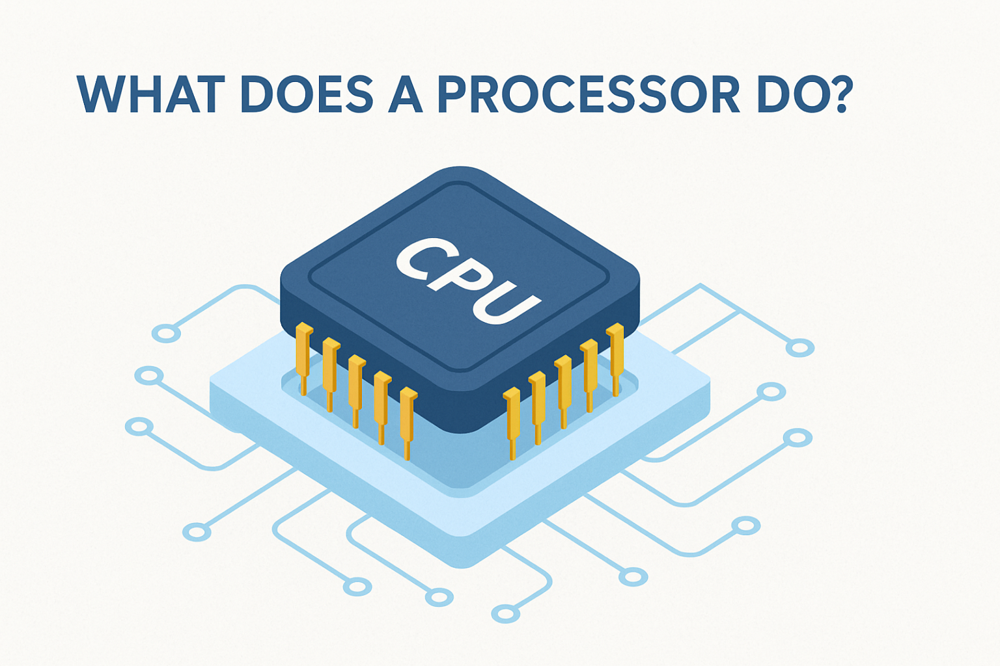
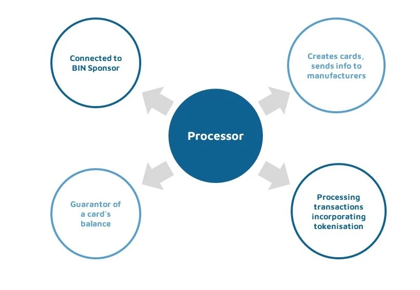
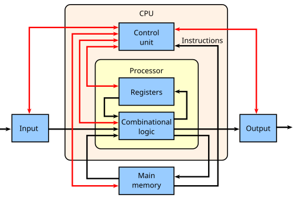

# RISC-V Architecture: Detailed Analysis & Guide

This study guide is designed to help you review the fundamental and advanced concepts of the RISC-V architecture. It covers the core components of processors, memory systems, instruction sets, and practical applications.
## Table of Contents
1. [Introduction_to_processore](#introduction-to-processors-and-digital-systems) 
    1.1 [Role_of_processors](#1-role-of-processors) 
    1.2 [Processor_functions](#2-processors-functions)

## Introduction to processors and digital systems
### <u>1. Role of processors </u>

Processors are integral to daily technology as the core components that execute instructions, process data, and enable computing devices to perform tasks. General-purpose processors like CPUs (Central Processing Units) handle a broad range of tasks including running operating systems, applications, and managing basic input/output functions. Specialized processors such as ISPs (Image Signal Processors), GPUs (Graphics Processing Units), and ML (Machine Learning) accelerators are designed for distinct, intensive tasks like image processing, rendering graphics, and accelerating AI computations, respectively.

<b>A. Role of General-Purpose CPUs</b> 
CPUs are often called the "brain" of computers because they execute instructions sequentially for a variety of general computing needs such as browsing the internet, handling files, or running software applications. They manage data flow and system operations by fetching, decoding, executing instructions, and storing results. Their design focuses on single-threaded and latency-sensitive operations, with multiple cores enabling some parallelism for multitasking and enhanced efficiency.

<b>B. Specialized Processors and Their Functions</b> 
<ul><li>ISPs (Image Signal Processors):</li> Specialized for real-time image and video processing, such as enhancing photo quality and managing camera inputs in smartphones and other devices.

<li>GPUs (Graphics Processing Units):</li> Originally designed to accelerate 3D graphics rendering by processing many operations in parallel with their numerous smaller cores. GPUs are also widely used for parallelizable tasks beyond graphics, like AI model training and data analysis, due to their ability to perform many calculations simultaneously.

<li>ML Accelerators:</li> These are dedicated processors designed to accelerate machine learning workloads efficiently by offloading specific AI computations from CPUs or GPUs, delivering faster training and inference speeds in AI applications.</ul>

<b>C. Integration and Importance</b> 
Modern computing systems often combine CPUs with specialized processors (such as integrated GPUs in system-on-chip designs) to balance general-purpose and specialized workloads, improving performance and energy efficiency. These processors collectively enable the smooth operation of technologies used daily—from smartphones to home automation to advanced AI-driven systems.

In summary, processors provide the computational foundation for all digital technology, with CPUs serving as versatile controllers and specialized processors like ISPs, GPUs, and ML accelerators enhancing performance for targeted tasks in modern computing environments. This differentiation allows devices to handle a vast array of user and system demands effectively.

### <u>2. Processors Functions</u> 
Processor's basic capabilities include performing arithmetic operations (addition, subtraction, multiplication, division), logic operations (AND, OR, NOT, XOR), and comparison operations (equal to, less than, greater than). It accesses memory to read and write data, manages decision-making based on instructions (e.g., branching or conditional execution), and handles input/output (I/O) operations to communicate with peripherals.

<b>A. Basic Functions of a Processor</b>
<ul><li>
Arithmetic Operations:</li> The Arithmetic Logic Unit (ALU) performs calculations like addition and subtraction.

<li>Logic Operations:</li> The ALU also performs logical operations such as AND, OR, NOT.

<li>Comparison:</li> The processor compares values to determine conditions for branching decisions.

<li>Memory Access:</li> It reads data from and writes data to system memory or registers.

<li>Decision Making:</li> Using conditional instructions, the processor controls the flow of programs by making decisions based on comparisons.

<li>Input/Output (I/O):</li> The processor communicates with external devices, coordinating data exchange through I/O operations.

<li>Instruction Cycle:</li> It fetches instructions from memory, decodes them to understand the operation, executes the operation, and stores the result as needed.
</ul>
<b>B. Limitations of a Processor</b> 
A processor cannot directly understand high-level abstract concepts such as human language or semantics. It operates on binary instructions and numerical data, so complex tasks like natural language understanding require specialized software or hardware accelerators for machine learning, which interpret and process high-level data on behalf of the CPU.
  
In summary, processors execute fundamental computational and control tasks essential for running software, but they do not inherently understand human languages or complex abstract data. These require additional layers of interpretation and computation beyond the processor's direct capabilities.